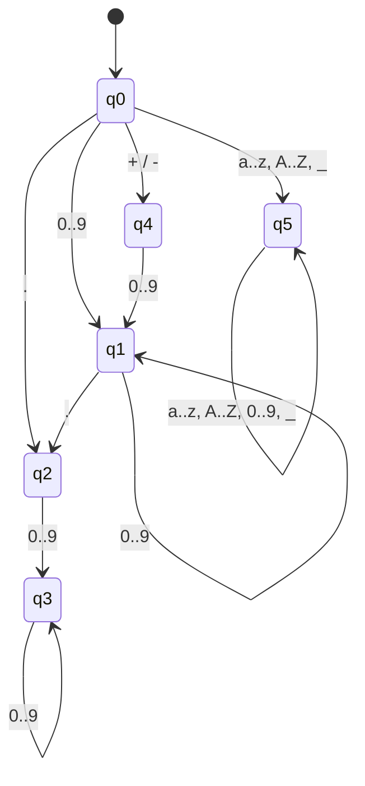

# Compiladores
# 🏛️ Análise Léxica — Autômato Finito Determinístico (AFD)

Especificação e regras de transição do analisador léxico **Álex**.

---

## 📌 Reconhecimento dos Tokens (Estados Finais)

* **`q1`**: `INTEIRO`
* **`q3`**: `FRACIONÁRIO`
* **`q5`**: `NOMEVARIÁVEL`

---

## ⚙️ Regras de Configuração do Autômato

```ini
[ESTADOS]
q0 q1 q2 q3 q4 q5

[SÍMBOLOS]
0 1 2 3 4 5 6 7 8 9 a b c d e f g h i j k l m n o p q r s t u v w x y z A B C D E F G H I J K L M N O P Q R S T U V W X Y Z _ + - .

[ESTADOS FINAIS : RECONHECE]
q1 : INTEIRO
q3 : FRACIONÁRIO
q5 : NOMEVARIÁVEL

[REGRAS DE TRANSIÇÃO]
# Formato -> EstadoInicial : Símbolo : EstadoFinal

# Transições a partir de q0
q0 : 0..9 : q1
q0 : + : q4
q0 : - : q4
q0 : . : q2
q0 : a..z, A..Z, _ : q5

# Transições a partir de q1 (INTEIRO)
q1 : 0..9 : q1
q1 : . : q2

# Transições a partir de q2
q2 : 0..9 : q3

# Transições a partir de q3 (FRACIONÁRIO)
q3 : 0..9 : q3

# Transições a partir de q4 (Sinal)
q4 : 0..9 : q1

# Transições a partir de q5 (NOMEVARIÁVEL)
q5 : a..z, A..Z, 0..9, _ : q5
```

---

## 🔄 Diagrama de Estados (Renderizado via Mermaid)


